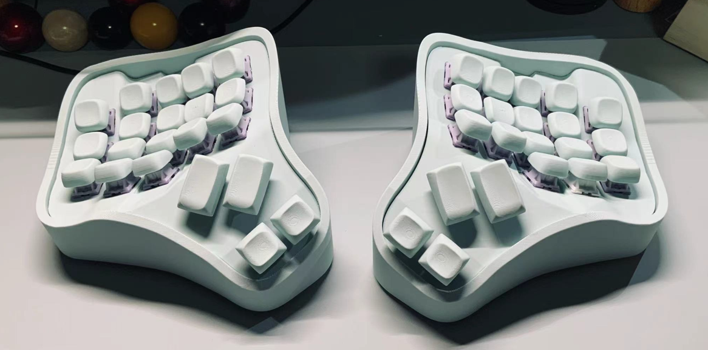

# cake

键盘名字暂定为蛋糕（cake），这是一个键盘系列，包含35,36,46配列，以及35轨迹球，36轨迹球，46轨迹球。

# 固件地址
- [zmk固件](git@github.com:LXF-YZP/cake-zmk-config.git)

以36配列为例进行构建:

## 3D文件
3D打印外壳文件在files文件夹下面，36配列的外壳在36文件夹下，36配列轨迹球在36_trackball文件夹下。一般情况下只提供了左侧部分外壳文件，右边外壳文件可以通过镜像生成。

## 元器件清单

|名称       |   数量    |购买链接                                          |
| --------------------------------- | ------ | ------------------------------------------------------------------------------------------ |
| pcb基板       |   2    | https://www.jlc.com/newOrder/#/pcb/pcbPlaceOrder                                          |
| 轴体                           | 48      |                                                                                            |
| 轴座          | 48     | 凯华轴座                                             |
| 锂电池503450/1000毫安            | 2     |   https://item.taobao.com/item.htm?_u=r1hre4eh0cfa&id=678474541123&spm=a1z09.2.0.0.4ee62e8ddZPkRD                                                                                         |
| nice nano v2主控                | 2    | https://item.taobao.com/item.htm?_u=r1hre4eh83a1&id=729260528560&spm=a1z09.2.0.0.4ee62e8dQMGRLh   |
| 螺柱 m2x4x3.5| 12    |     |                                                                                        |
| 螺丝   m2x4                | 4      |  |
| 二极管          | 48     | https://item.taobao.com/item.htm?spm=a1z09.2.0.0.70352e8dhrJ7E7&id=528155613240&_u=q1hre4eh412c                                                                        |
| reset开关          | 2     | https://item.taobao.com/item.htm?spm=a1z09.2.0.0.70352e8dhrJ7E7&id=546724645617&_u=q1hre4eh5b12                                                                        |
| 卧贴连接器          | 2     | https://item.taobao.com/item.htm?spm=a1z09.2.0.0.70352e8dhrJ7E7&id=565715285795&_u=q1hre4eh267c                                                                        |
| 拨动开关          | 2     | https://item.taobao.com/item.htm?spm=a1z09.2.0.0.70352e8dhrJ7E7&id=557092773462&_u=q1hre4eh5b2e                                                                        |
| 超薄卧贴端子          | 2     | https://item.taobao.com/item.htm?spm=a1z09.2.0.0.67002e8dcmPRUr&id=671868863106&_u=q1hre4eh5865                                                                        |

- nice nano v2主控对应针脚图

针脚图请查看pics/12.png以及pics/13.png

- 注意二极管方向

二极管方向请查看pics/14.png和pics/15.png

- 轨迹球模块使用的开源方案
[轨迹球pcb](https://github.com/siderakb/pmw3610-pcb)

## 外壳打印
- 自己使用3D打印机进行打印，本人使用拓竹A1打印，效果不错。

- 在未来工厂进行下单打印。

- 在三维猴进行下单打印。

# 构建指南

_具体构建指南请参考B站视频讲解_

